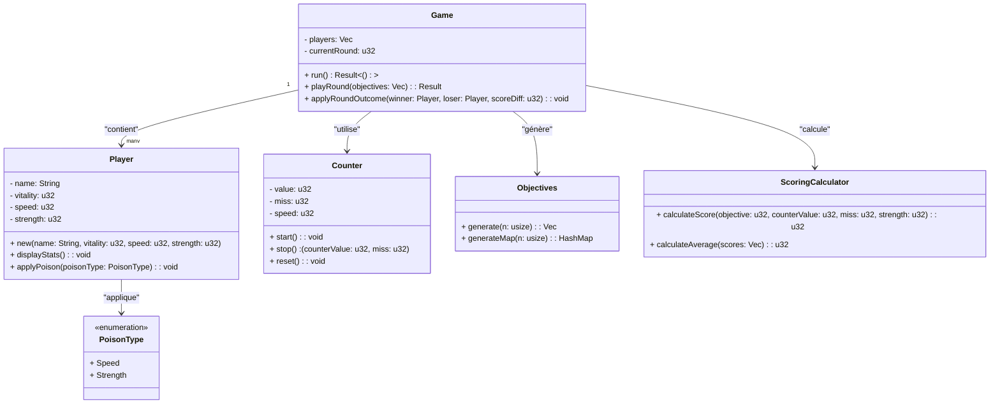

# Projet : Jeu de duel

Ce projet est un jeu en ligne de commande développé en Rust où des joueurs s'affrontent tour par tour dans une série de manches. Chaque joueur dispose de caractéristiques (vitalité, vitesse, force) qui évoluent au fil des manches. Le candidat doit arrêter un compteur en appuyant sur la touche **Entrée** pour se rapprocher le plus possible d'objectifs aléatoires générés. Le score est alors calculé selon la différence entre le nombre ciblé et le résultat obtenu, et des actions (poisons sur vitesse ou force) impactent les caractéristiques pour les manches suivantes.

---

## Table des matières

- [Présentation](#présentation)
- [Fonctionnalités](#fonctionnalités)
- [Architecture et Design](#architecture-et-design)
- [Installation et Exécution](#installation-et-exécution)
- [Tests et Conformité](#tests-et-conformité)
- [Dépendances et Crates Utilisés](#dépendances-et-crates-utilisés)
- [Exemple de Déroulement](#exemple-de-déroulement)
- [Crédits](#crédits)

---

## Présentation

Le jeu de duel oppose deux (voire plus, grâce à une variante bonus) joueurs caractérisés par :

- **Nom**
- **Vitalité** (points de vie)
- **Vitesse**
- **Force**

Au début de chaque tour, un tableau d'objectifs est généré aléatoirement (nombres compris entre 0 et 100 ou sous forme de HashMap pour la variante bonus). Chaque objectif est présenté au joueur qui doit appuyer sur **Entrée** pour démarrer le compteur. Ce compteur, incrémenté selon la vitesse du joueur, se fige lors d'un nouvel appui sur **Entrée** pour chaque objectif. Un score est calculé à partir de la proximité du compteur par rapport à l'objectif en cours, puis la moyenne des scores pour la manche est calculée.

À la fin de chaque manche :

- Le joueur avec le score moyen le plus élevé gagne.
- Le perdant voit sa vitalité diminuer de la différence entre les scores.
- Le gagnant choisit ensuite l'application d'un "poison" sur le perdant, impactant soit sa vitesse (-5), soit sa force (-5) pour les manches suivantes.

La partie se termine lorsqu'un joueur n'a plus de vitalité.

---

## Fonctionnalités

- **Génération d'objectifs aléatoires** : À chaque tour, les objectifs sont régénérés avec une valeur entre 0 et 100.
- **Gestion du compteur avec thread dédié** : Le compteur et le nombre de "miss" sont mis à jour toutes les 30ms via un thread d’affichage.
- **Calcul de score** : La formule de score tient compte de la différence entre l'objectif et le résultat obtenu, en prenant soin de gérer les différences en cas de dépassement (par exemple, un résultat de 95 pour un objectif de 15 implique une différence de 20 et non 80).
- **Poison** : Le joueur gagnant peut infliger une pénalité au perdant (réduction de 5 points en vitesse ou en force).
- **Modes de jeu étendus** : Possibilité d'ajouter plus de deux joueurs.
- **Variante bonus** :
  - Utilisation d'une HashMap pour représenter les objectifs, associant chaque lettre du clavier à une valeur cible. Un appui sur la mauvaise touche entraine un score de 0 pour l’objectif.
- **Logging et gestion d'erreurs** : Utilisation de crates tels que `log`, `env_logger` pour logger différents niveaux de messages, et gestion systématique des erreurs avec `Result<T>`.

---

## Architecture et Design

La conception orientée objet repose sur plusieurs modules et classes, dont voici un aperçu via le diagramme de classes (en *mermaid*) :



Les principales interactions sont les suivantes :

- **Game** orchestre le déroulement de la partie et gère les manches.
- **Player** représente le joueur et ses caractéristiques, et applique les effets des poisons.
- **Counter** s'occupe de la gestion du temps et de l'affichage du compteur avec son thread dédié.
- **Objectives** génère les objectifs pour chaque tour (sous forme de liste ou de HashMap pour la variante bonus).
- **ScoringCalculator** effectue le calcul du score pour chaque objectif et la moyenne générale pour le tour.
- **PoisonType** permet de choisir l'effet négatif appliqué au joueur perdant.

---

## Installation et Exécution

### Prérequis

- Rust (version stable recommandée)
- Cargo

### Compilation et Exécution

Clonez le dépôt Git public et positionnez-vous dans le répertoire du projet :

```bash
git clone <URL_DU_DEPOT>
cd projet-jeu-de-duel
```

Pour compiler et exécuter le jeu :

```bash
cargo run -- --name1 Michel --name2 Jacque --vitality 50 --objectifs 5
```

Remarque : Les arguments de ligne de commande sont gérés via la crate `clap`. Vous pouvez configurer les noms des joueurs, la vitalité initiale et le nombre d'objectifs par manche.

---

## Tests et Conformité

- **Tests unitaires** : Chaque fonction ou méthode critique du projet possède au moins un test unitaire. Pour lancer les tests, utilisez :

    ```bash
    cargo test
    ```

- **Gestion des erreurs** : Toutes les fonctions potentiellement sujettes à des erreurs retournent un type `Result<T>`.

- **Style Guides Rust** : Le code est conforme aux recommandations de Clippy.

---

## Dépendances et Crates Utilisés

- `clap` : Gestion des arguments en ligne de commande.
- `rand` : Génération aléatoire (notamment pour les objectifs).
- `log` et `env_logger` : Gestion des messages de log aux différents niveaux (`error!`, `warn!`, `info!`, `debug!`, `trace!`).
- `std::thread` : Pour le thread dédié à l'affichage du compteur et de la variable miss.

---

## Exemple de Déroulement

Voici un exemple simplifié d'une session de jeu :

```bash
$ cargo run -- --name1 Michel --name2 Jacque --vitality 50 --objectifs 5
##### Démarrage de la partie #####
## Manche 1 ##
Au tour de Michel (Vitality=50, Speed=50, Strength=50)
→ Objectifs : [50, 82, 74, 33, 95]
→ Appuyer sur ENTREE pour démarrer le tour..
→ Objectif 50 : Miss = 1 | Compteur = 36   // Score = (40 + 50) / 2 = 45
→ Objectif 82 : Miss = 0 | Compteur = 80   // Score = (80 + 50) / 1 = 130
→ Objectif 74 : Miss = 0 | Compteur = 70   // Score = (80 + 50) / 1 = 130
→ Objectif 33 : Miss = 1 | Compteur = 43   // Score = (60 + 50) / 2 = 55
→ Objectif 95 : Miss = 1 | Compteur = 90   // Score = (80 + 50) / 2 = 65
# Fin du tour #
→ Score moyen 85

Au tour de Jacque (Vitality=50, Speed=50, Strength=50)
...
Jacque gagne la manche. Michel perd 13 points de vitalité.
Jacque vous devez choisir quel poison appliquer à Michel :
→ 1: -5 speed
→ 2: -5 strength
>2

## FIN Manche 1 ##
...
##### Partie terminée #####
Relancer une partie ? [Y/N]
> y
##### Démarrage de la partie #####
...
```

---

## Crédits

**Auteur** : Corentin GAUTHIER  
**Date** : mars 2025  

Ce projet a été réalisé dans le cadre d'un exercice de programmation en Rust, visant à appliquer les principes de développement sécurisé, de test unitaire et de respect des bonnes pratiques du langage.
